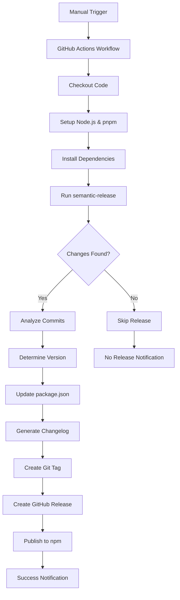

# Design Document

## Overview

This design implements semantic release automation for the slidev-theme-improving-25 package using the semantic-release npm package and GitHub Actions. The system will provide manual release triggering while automating version determination, changelog generation, and GitHub release creation based on conventional commit messages.

The solution leverages the established semantic-release ecosystem which is widely adopted in the JavaScript/Node.js community and provides robust, battle-tested automation for package releases.

## Architecture

### High-Level Flow



### Components Overview

1. **GitHub Actions Workflow**: Orchestrates the entire release process
2. **semantic-release**: Core automation engine for version management
3. **Conventional Commits Parser**: Analyzes commit messages for version determination
4. **Changelog Generator**: Creates CHANGELOG.md entries
5. **GitHub Release Creator**: Publishes releases with notes
6. **npm Publisher**: Publishes package to npm registry

## Components and Interfaces

### GitHub Actions Workflow

**File**: `.github/workflows/release.yml`

**Purpose**: Provides manual trigger interface and orchestrates the release process

**Key Features**:
- Manual trigger via `workflow_dispatch` event
- Input parameter for release type override (auto, patch, minor, major)
- Runs only on main branch
- Secure environment with proper permissions

**Inputs**:
- `release-type`: Optional override for automatic version determination
- `dry-run`: Optional flag to test release process without publishing

### semantic-release Configuration

**File**: `.releaserc.json`

**Purpose**: Configures semantic-release behavior and plugins

**Plugins Configuration**:
1. `@semantic-release/commit-analyzer`: Analyzes commits for version bumps
2. `@semantic-release/release-notes-generator`: Generates release notes
3. `@semantic-release/changelog`: Maintains CHANGELOG.md file
4. `@semantic-release/npm`: Updates package.json and publishes to npm
5. `@semantic-release/github`: Creates GitHub releases
6. `@semantic-release/git`: Commits version changes back to repository

### Commit Message Convention

**Standard**: Angular Conventional Commits

**Format**: `<type>(<scope>): <description>`

**Types**:
- `feat`: New features (minor version bump)
- `fix`: Bug fixes (patch version bump)
- `perf`: Performance improvements (patch version bump)
- `docs`: Documentation changes (no version bump)
- `style`: Code style changes (no version bump)
- `refactor`: Code refactoring (no version bump)
- `test`: Test additions/modifications (no version bump)
- `chore`: Build process or auxiliary tool changes (no version bump)

**Breaking Changes**: Include `BREAKING CHANGE:` in footer or use `!` after type (major version bump)

## Data Models

### Release Configuration Schema

```typescript
interface ReleaseConfig {
  branches: string[];
  plugins: PluginConfig[];
  preset: string;
  tagFormat: string;
}

interface PluginConfig {
  name: string;
  options?: Record<string, any>;
}
```

### Workflow Input Schema

```typescript
interface WorkflowInputs {
  'release-type'?: 'auto' | 'patch' | 'minor' | 'major';
  'dry-run'?: boolean;
}
```

### Changelog Entry Schema

```typescript
interface ChangelogEntry {
  version: string;
  date: string;
  sections: {
    breaking: CommitInfo[];
    features: CommitInfo[];
    fixes: CommitInfo[];
    performance: CommitInfo[];
  };
}

interface CommitInfo {
  hash: string;
  subject: string;
  scope?: string;
  author: string;
}
```

## Error Handling

### Workflow-Level Error Handling

1. **Branch Validation**: Ensure workflow only runs on main branch
2. **Permission Validation**: Verify GitHub token has necessary permissions
3. **Dependency Installation**: Handle npm/pnpm installation failures
4. **semantic-release Failures**: Capture and report semantic-release errors

### semantic-release Error Scenarios

1. **No Releasable Changes**: Skip release and notify user
2. **Version Conflict**: Handle cases where version already exists
3. **npm Publish Failure**: Rollback version changes if publish fails
4. **GitHub Release Failure**: Continue with npm publish but log error
5. **Git Push Failure**: Retry with exponential backoff

### Recovery Mechanisms

1. **Atomic Operations**: Ensure all-or-nothing release process
2. **Rollback Strategy**: Revert version changes if critical steps fail
3. **Retry Logic**: Implement retries for network-related failures
4. **Manual Intervention**: Provide clear error messages for manual resolution

## Testing Strategy

### Pre-Release Validation

1. **Dry Run Mode**: Test release process without actual publishing
2. **Commit Message Validation**: Verify conventional commit format
3. **Version Calculation**: Validate semantic version determination
4. **Changelog Generation**: Verify changelog content accuracy

### Integration Testing

1. **Workflow Testing**: Test GitHub Actions workflow in feature branches
2. **semantic-release Testing**: Validate configuration with test repositories
3. **npm Package Testing**: Verify package integrity after release
4. **GitHub Release Testing**: Validate release notes and assets

### Monitoring and Validation

1. **Release Success Metrics**: Track successful vs failed releases
2. **Version Accuracy**: Validate semantic versioning compliance
3. **Changelog Quality**: Review generated changelog entries
4. **User Feedback**: Monitor GitHub issues for release-related problems

## Security Considerations

### GitHub Token Permissions

Required permissions for `GITHUB_TOKEN`:
- `contents: write` - For creating tags and updating files
- `issues: write` - For creating releases
- `pull-requests: write` - For updating PR status

### npm Token Security

- Use `NPM_TOKEN` secret for npm publishing
- Configure token with publish-only permissions
- Rotate tokens regularly

### Workflow Security

- Restrict workflow to main branch only
- Use pinned action versions for security
- Validate inputs to prevent injection attacks
- Use minimal required permissions

## Configuration Files

### `.releaserc.json`
```json
{
  "branches": ["main"],
  "preset": "angular",
  "tagFormat": "v${version}",
  "plugins": [
    "@semantic-release/commit-analyzer",
    "@semantic-release/release-notes-generator",
    [
      "@semantic-release/changelog",
      {
        "changelogFile": "CHANGELOG.md"
      }
    ],
    "@semantic-release/npm",
    [
      "@semantic-release/github",
      {
        "assets": []
      }
    ],
    [
      "@semantic-release/git",
      {
        "assets": ["CHANGELOG.md", "package.json"],
        "message": "chore(release): ${nextRelease.version} [skip ci]\n\n${nextRelease.notes}"
      }
    ]
  ]
}
```

### GitHub Actions Workflow Structure
- Manual trigger with `workflow_dispatch`
- Input validation and branch restriction
- Node.js and pnpm setup
- semantic-release execution
- Success/failure notifications

## Implementation Considerations

### Package Manager Compatibility

The project uses pnpm as indicated by `pnpm-lock.yaml`. The workflow will:
- Use pnpm for dependency installation
- Ensure semantic-release works with pnpm
- Configure npm publishing regardless of local package manager

### Existing Version Management

Current version in package.json is `1.0.3`. The semantic-release setup will:
- Respect existing version as baseline
- Continue semantic versioning from current state
- Maintain version history in git tags

### Changelog Integration

- Create initial CHANGELOG.md if it doesn't exist
- Preserve any existing changelog content
- Follow conventional changelog format
- Include migration notes for breaking changes