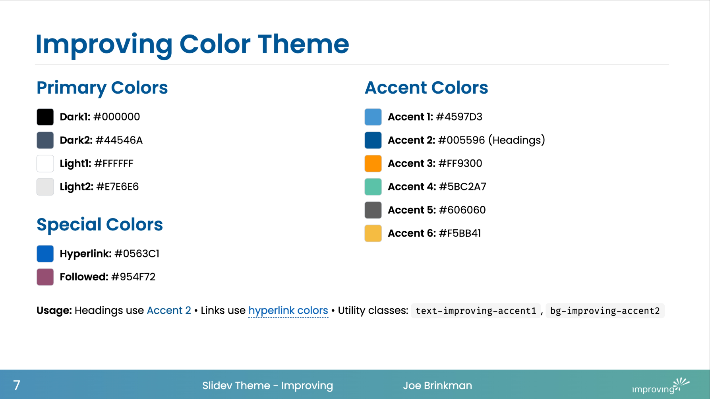

# slidev-theme-improving-25

[](https://www.npmjs.com/package/slidev-theme-improving-25)

A theme for [Slidev](https://github.com/slidevjs/slidev) based on the Improving Powerpoint theme.

<!--
  Learn more about how to write a theme:
  https://sli.dev/guide/write-theme.html
--->

<!--
  run `npm run dev` to check out the slides for more details of how to start writing a theme
-->

<!--
  Put some screenshots here to demonstrate your theme

  Live demo: [...]
-->

## Install

Add the following frontmatter to your `slides.md`. Start Slidev then it will prompt you to install the theme automatically.

<pre><code>---
theme: <b>improving-25</b>
---</code></pre>

Learn more about [how to use a theme](https://sli.dev/guide/theme-addon#use-theme).

## Layouts

This theme provides the following layouts:

### `default`
The standard layout with ImprovingFooter. Includes H1 title bar styling with subtle borders and supports both light and dark modes.

### `image-right`
Two-column layout with content on the left and image on the right. Includes ImprovingFooter.

### `image-left`
Two-column layout with image on the left and content on the right. Includes ImprovingFooter.

### Built-in Layouts
This theme also supports all standard Slidev layouts. See the [Slidev Built-in Layouts documentation](https://sli.dev/builtin/layouts) for `cover`, `intro`, `center`, and other available layouts.

## Components

This theme provides the following components:

### `ImprovingFooter`
A comprehensive footer component that displays:

- **Page numbers** - Current slide number
- **Global title** - Presentation title from frontmatter
- **Global author** - Author name from frontmatter  
- **Company logo** - Improving logo with custom logo support
- **Gradient background** - Official Improving brand colors

#### Footer Configuration
Control footer elements via frontmatter:

```yaml
---
showFooter: true          # Master switch (default: true)
showPageNumber: true      # Show page number (default: true)
showLogo: true           # Show logo (default: true)
showTitle: true          # Show title (default: true)
showAuthor: true         # Show author (default: true)
customLogo: './logo.svg' # Custom logo path (optional)
---
```

## Contributing

Interested in contributing? See our [Contributing Guide](CONTRIBUTING.md) for development setup, commit guidelines, and pull request process.

## Features

### Color Theme
Based on official Improving PowerPoint theme colors:



- **Primary Colors**: Dark1, Dark2, Light1, Light2
- **Accent Colors**: 6 branded accent colors for highlights and emphasis
- **Automatic theming**: Supports both light and dark modes
- **Utility classes**: Complete set of `text-improving-*` and `bg-improving-*` classes

### Typography

- **Headings**: Use Accent 2 color (#005596) with subtle borders
- **Links**: Proper hyperlink and visited link colors
- **Font**: [Poppins](https://fonts.google.com/specimen/Poppins) sans-serif for clean, modern appearance

### Layout Features

- **Responsive design**: Works on different screen sizes
- **Consistent footer**: Appears on all theme layouts. Can be hidden when not needed.
- **Image layouts**: Support for left and right image positioning
- **Theme-aware styling**: Adapts to light/dark mode preferences
